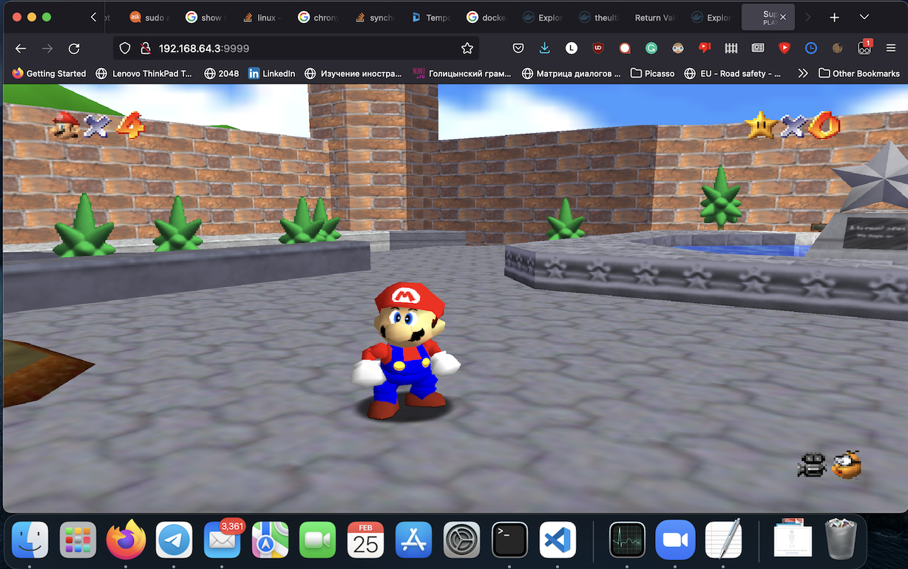
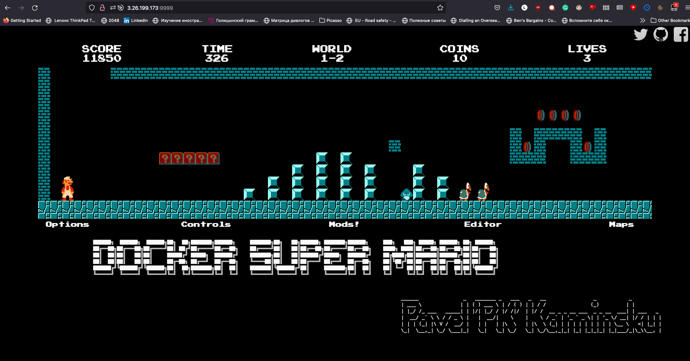

# ansible_first_lesson

Я тут немного запарился с окружением: у меня MacBook на M1, и там с виртуалками поплохее. Единственное бесплатное и простое, что нашлось, это https://multipass.run, а он любит только Ubuntu. Так что проекты делались для Ubuntu Server 20.04 LTS.
Виртуалки, соответственно, на aarch64, а на этой платформе ни вебдума, ни супермарио нет.
Поэтому я поставил Марио для ARM64, который был, но это не тот Марио:

После отладки сценария, я поднял убунту на AWS, и, ура, он выполнился без ошибок. Так что вот вам скриншот Супермарио (после первого уровня, скрин на первом уровне я сделал, но там не было адреса):

С nginx оказалось всё более портабельно, так что сценарий работает на любых совместимых платформах (тестировал на aarch64 и amd64).

Для работы сценария nginx на Ubuntu необходимы модули:

`ansible-galaxy collection install community.general` (для настройки firewall'а)

`ansible-galaxy collection install community.crypto` (для генерации сертификата)